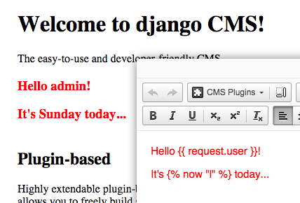
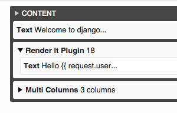
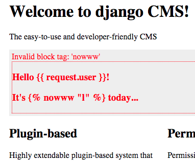

# djangocms-renderit

CMS plugin that renders any content as if it was a Django template. v0.2.3

## Wait... what?

This app provides a DjangoCMS plugin called **RenderitPlugin** (now isn't that just cool). The 
plugin can hold any number of child plugins, such as Text, Link, etc. Once all child plugins have 
rendered, the RenderitPlugin takes the output and renders it again, but treating it like a Django 
template code.

## But... why??
 
Excellent question! It is probably best not to use this plugin :)  No, seriously, for most problems 
that this plugin seems to solve, a much better approach is to use / develop a custom plugin.
Now go and develop a custom DjangoCMS plugin. It' simple. 
[Here](http://django-cms.readthedocs.org/en/latest/how_to/custom_plugins.html).
Off you go... Bye-bye!

## Ok... how?

Still here? Oh my... I guess you think this plugin might be useful after all. 

### Read this first!

Have you considered syntax errors that might pop up from the fact that your content just became a 
Django template code?
 
What about security? XSS anyone? It is your responsibility to make sure this plugin is used safely!

### Just show me the plugin already!

Alright, here it is. Instead of describing how it works, here are some screenshots... 

#### in Edit mode and rendered:

#### in structure mode:

#### template error:

## Anything else?

Well... It handles context well, inheriting the default context for CMS plugins. There is also 
option to load custom template libraries, either globally or for specific plugins.

### Installation

Oh nothing fancy:

    pip install djangocms_renderit_plugin
    
and:

    INSTALLED_APPS = (
        ...
        'djangocms_renderit_plugin',
        ...
    )

and lastly:

    python manage.py migrate
    

### Settings

#### `CMS_RENDERIT_TAG_LIBRARIES`
    
Optional, defaults to `[]`

List of strings, specifying templatetag libraries to be used in `` tag when rendering 
content.

## Other stuff...

Tested with:

 - DjangoCMS 3.1
 - Django 1.7.8
 - Python 3.4.3, Python 2.7.9

### TODO

 * maybe remove the `_plugin` from `djangocms_renderit_plugin`
 * tests for edit mode
 * tests for HTML entities (`&quote;`, `&nbsp;`, etc.)
 